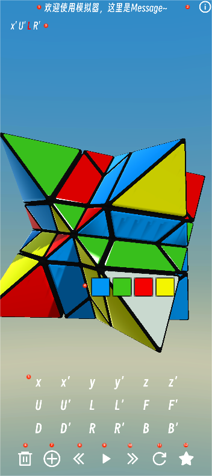

# Troy-3D-Star-Cube-Simulator
 

# Info
1. 适用平台：Android
2. 当前版本：1.1 beta

# HomePage

0. **双指**拖动旋转模型
1. 信息栏：展示操作或提示信息
2. About页：前往关于页面
3. 操作队列：所有操作在此展示，文本可左右拖动，当前执行步骤标记为红色
4. 颜色面板：长按想要替换颜色的面片，打开颜色面板(此时选中的面片颜色替换为灰色)
5. 操作按钮栏：所有可执行操作选择按钮
6. 清空按钮：清除操作队列所有操作(魔方不重置)
7. 添加按钮：打开/关闭操作按钮栏
8. 上一步按钮：执行上一步操作
9. 自动执行按钮：自动执行操作队列剩余操作
10. 下一步按钮：执行下一步操作
11. 重置按钮：重置魔方(不清空操作列表)
12. 随机按钮：随机打乱魔方

## 欢迎使用Troy 3D Star模拟器~